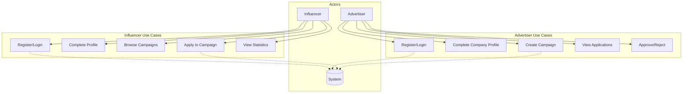

# Influencer Platform - Software Design Assignment

**Student Name**: [Adınız Soyadınız]
**Course**: Software Engineering / System Analysis & Design
**Date**: 2025
**Project**: Influencer-Advertiser Collaboration Platform

---

## Project Description

This project is a mobile application platform that connects **Influencers** (content creators) with **Advertisers** (brands/companies). Influencers can browse campaigns and apply to them, while Advertisers can create campaigns and manage applications.

**Technology Stack:**
- Frontend: Android (Jetpack Compose - Kotlin)
- Backend: Firebase (Authentication + Firestore Database)
- Architecture: MVVM

---

## 1. Use Case Diagram

### Actors:
1. **Influencer** - Content creator who applies to campaigns
2. **Advertiser** - Brand/company that creates campaigns
3. **System** - Firebase backend system

### Use Cases:

#### Influencer Use Cases:
- UC1: Register/Login
- UC2: Complete Profile (platforms, categories, bio)
- UC3: Browse Campaigns
- UC4: Apply to Campaign
- UC5: View Active Campaigns
- UC6: View Statistics
- UC7: Update Profile
- UC8: Logout

#### Advertiser Use Cases:
- UC9: Register/Login
- UC10: Complete Company Profile
- UC11: Create Campaign
- UC12: View Applications
- UC13: Approve/Reject Application
- UC14: View Campaign Performance
- UC15: Search Influencers
- UC16: Logout

### Use Case Diagram:



---

## 2. User Interface (UI) Prototype / Mockups

### 2.1 Authentication Screens

#### Login Screen
```
┌─────────────────────────────┐
│  ← Back                     │
│                             │
│  Login                      │
│  Enter your credentials     │
│                             │
│  ┌─────────────────────┐    │
│  │ 📧 Email            │    │
│  │ email@example.com   │    │
│  └─────────────────────┘    │
│                             │
│  ┌─────────────────────┐    │
│  │ 🔒 Password         │    │
│  │ ••••••••         👁 │    │
│  └─────────────────────┘    │
│                             │
│  ┌─────────────────────┐    │
│  │      LOGIN          │    │
│  └─────────────────────┘    │
│                             │
│  Don't have account? Sign up│
└─────────────────────────────┘
```

### 2.2 Influencer Home Screen
```
┌─────────────────────────────┐
│  Welcome! 👋                │
│  New opportunities for you  │
│                             │
│  ┌─────┐ ┌─────┐ ┌─────┐   │
│  │ 👁  │ │ 📢 │ │ 💰 │   │
│  │12.5K│ │ 3  │ │₺8.4K│   │
│  │Views│ │Camp│ │Earn│    │
│  └─────┘ └─────┘ └─────┘   │
│                             │
│  Active Campaigns           │
│  ┌───────────────────────┐  │
│  │ Phone Review          │  │
│  │ TechVision A.Ş.       │  │
│  │ ⏱ 5 days left         │  │
│  │ ▓▓▓▓▓▓▓░░░ 65%       │  │
│  └───────────────────────┘  │
│                             │
│  New Opportunities          │
│  ← ──────────────────── →  │
│  ┌───────────────────────┐  │
│  │ 🏢 TechVision A.Ş. ✓ │  │
│  │ Technology            │  │
│  │ Budget: ₺5K-₺15K     │  │
│  │ [Apply]              │  │
│  └───────────────────────┘  │
│                             │
│  [🏠 Home]    [👤 Profile] │
└─────────────────────────────┘
```

### 2.3 Influencer Profile Screen
```
┌─────────────────────────────┐
│  ══ Cover Image ══════════  │
│       ┌─────┐               │
│       │ 👤  │               │
│       └─────┘               │
│   user@email.com            │
│   Content Creator           │
│                             │
│  ┌────────────────────┐     │
│  │ ✏ Edit Profile     │     │
│  └────────────────────┘     │
│                             │
│  ┌────────────────────────┐ │
│  │ 24.5K | 8.2% | 12 | 4.8││
│  │ Follow  Eng   Camp  Rate││
│  └────────────────────────┘ │
│                             │
│  Platforms                  │
│  ▶ YouTube - 12.5K          │
│  📷 Instagram - 8.3K        │
│                             │
│  Categories                 │
│  [Tech] [Gaming] [Lifestyle]│
│                             │
│  [🏠 Home]    [👤 Profile] │
└─────────────────────────────┘
```

### 2.4 Advertiser Home Screen
```
┌─────────────────────────────┐
│  Campaigns Active 🚀        │
│                             │
│  ┌─────┐ ┌─────┐ ┌─────┐   │
│  │ 📢  │ │ 👁  │ │ 💰  │   │
│  │  5  │ │1.2M │ │₺45K │   │
│  │Camp │ │Reach│ │Budget│   │
│  └─────┘ └─────┘ └─────┘   │
│                             │
│  Pending Applications       │
│  ┌───────────────────────┐  │
│  │ 👤 Selin Arslan       │  │
│  │ YouTube - 95K         │  │
│  │ Requested: ₺8,500     │  │
│  │ [Reject] [Approve]    │  │
│  └───────────────────────┘  │
│                             │
│  Active Campaigns           │
│  ┌───────────────────────┐  │
│  │ Product Launch 2024   │  │
│  │ 3 Influencers         │  │
│  │ ⏱ 15 days left        │  │
│  │ [View Details]        │  │
│  └───────────────────────┘  │
│                             │
│  [🏠 Home]    [👤 Profile] │
└─────────────────────────────┘
```

### 2.5 Advertiser Profile Screen
```
┌─────────────────────────────┐
│  ══ Cover Image ══════════  │
│       ┌─────┐               │
│       │ 🏢  │               │
│       └─────┘               │
│   TechVision A.Ş.           │
│   ✓ Verified Company        │
│                             │
│  ┌────────────────────┐     │
│  │ ✏ Edit Profile     │     │
│  └────────────────────┘     │
│                             │
│  ┌────────────────────────┐ │
│  │  12  |  28  | 2.4M | 94%││
│  │ Camp  Infl  Reach Success││
│  └────────────────────────┘ │
│                             │
│  Target Platforms           │
│  ▶ YouTube - 5 campaigns    │
│  📷 Instagram - 8 campaigns │
│                             │
│  Target Categories          │
│  [Tech] [Gaming] [Lifestyle]│
│                             │
│  [🏠 Home]    [👤 Profile] │
└─────────────────────────────┘
```

---

## 3. UML Class Diagram

### Core Entities and Relationships



### Key Relationships:

#### 1. Inheritance (IS-A)
- **User → Influencer**: Influencer extends User with specific attributes
- **User → Advertiser**: Advertiser extends User with company-specific attributes
- **Multiplicity**: 1:1

#### 2. Association
- **Advertiser → Campaign** (1:*)
  - One advertiser creates multiple campaigns
  - Each campaign belongs to one advertiser

- **Campaign → Application** (1:*)
  - One campaign has multiple applications
  - Each application belongs to one campaign

- **Influencer → Application** (1:*)
  - One influencer submits multiple applications
  - Each application from one influencer

#### 3. Aggregation (Shared Ownership)
- **User → Platform** (*:*)
  - Users can use multiple platforms
  - Platforms can be used by multiple users
  - Platform exists independently

- **User → Category** (*:*)
  - Users interested in multiple categories
  - Categories exist independently

#### 4. Composition (Strong Ownership)
- **Influencer → Statistic** (1:1)
  - Each influencer has one statistic object
  - Statistic destroyed when influencer deleted

- **Campaign → CampaignPerformance** (1:1)
  - Each campaign has one performance record
  - Performance destroyed when campaign deleted

### Class Attributes & Methods Summary:

| Class | Key Attributes | Key Methods |
|-------|---------------|-------------|
| **User** | userId, email, userType | login(), logout() |
| **Influencer** | platforms, categories, bio | applyToCampaign() |
| **Advertiser** | companyName, verified | createCampaign() |
| **Campaign** | title, budget, status | create(), publish() |
| **Application** | requestedAmount, status | submit(), approve() |
| **Statistic** | totalEarnings, rating | calculate() |

---

## Database Schema (Firebase Firestore)

### Collections Structure:

```
users/
  {userId}/
    - email: string
    - userType: string
    - profileCompleted: boolean
    - platforms: array
    - categories: array
    - bio: string (for influencer)
    - companyName: string (for advertiser)

campaigns/
  {campaignId}/
    - title: string
    - advertiserId: string
    - budget: number
    - status: string
    - startDate: timestamp
    - endDate: timestamp

    applications/
      {applicationId}/
        - influencerId: string
        - requestedAmount: number
        - status: string
        - appliedDate: timestamp

platforms/
  {platformId}/
    - name: string
    - type: string

categories/
  {categoryId}/
    - name: string
```

---

## Conclusion

This assignment demonstrates the complete software design for the Influencer Platform, including:
1. ✅ **Use Case Diagram** - Showing all actors and their interactions
2. ✅ **UI Prototypes** - Wireframes for all major screens
3. ✅ **UML Class Diagram** - Complete domain model with relationships

The system follows object-oriented principles with clear inheritance, association, aggregation, and composition relationships. All multiplicities are properly defined, showing one-to-one, one-to-many, and many-to-many relationships between entities.
